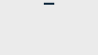
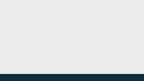
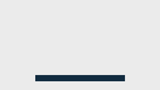

iRacing Browser Apps TV style overlay addon
===========================================

Various modular TV style overlays heavily inspired by 2015 season FIA WEC for [iRacing Browser Apps by Mihail Latyshov](http://ir-apps.kutu.ru/).

Main purpose is to recreate a TV like experience for watched sessions or replays in iRacing. You add the modules to different scenes in OBS (or your other favorite capture software) and switch between scenes as you see fit.

Usage
=====

1. Obviously you need the [iRacing Browser Server by Mihail Latyshov](http://ir-apps.kutu.ru/)
2. Download the latest release from the [releases](//github.com/MorisatoK/ir-tvstyleoverlay/releases).
3. Extract contents of the ZIP into your iR Browser Server "apps" directory.
4. Start the server application and point a browser of your choice to ´http://localhost:8182/ir-tvstyleoverlay/´ (assuming default settings) and follow the instructions there.

Currently the following modules are available:

Session Info
------------

Displays remaining session time or laps as well as some flag information.

Gap Ticker
----------

Displays current standings and driver/team info in a ticker at the bottom of the screen.

Driver Info
-----------

Displays driver/team info and overall/class position of the car in focus.
